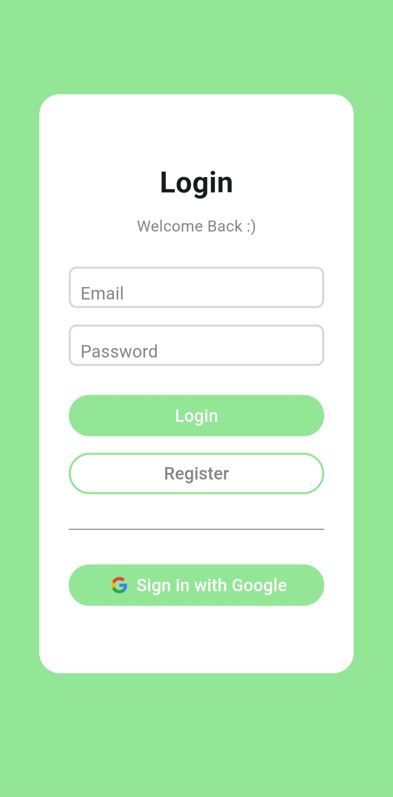
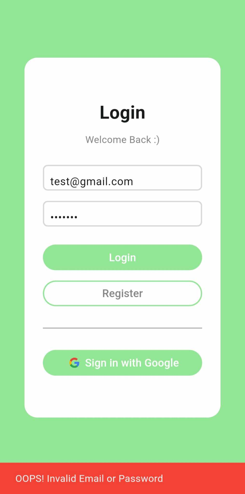
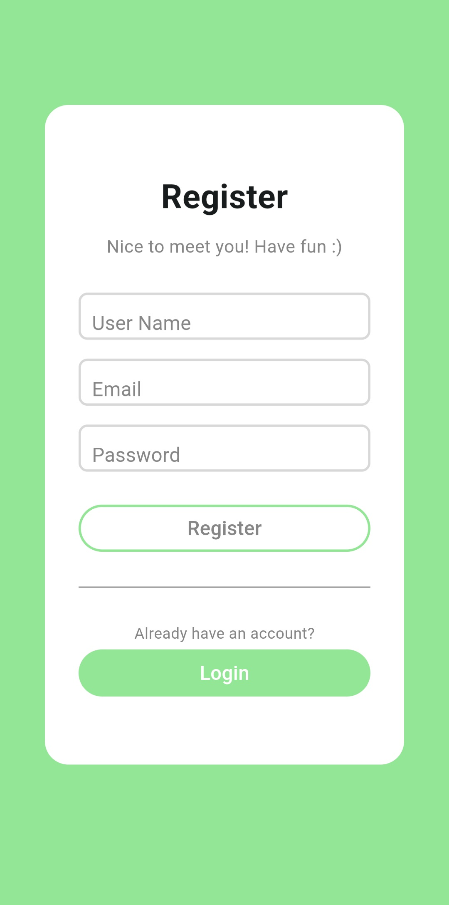
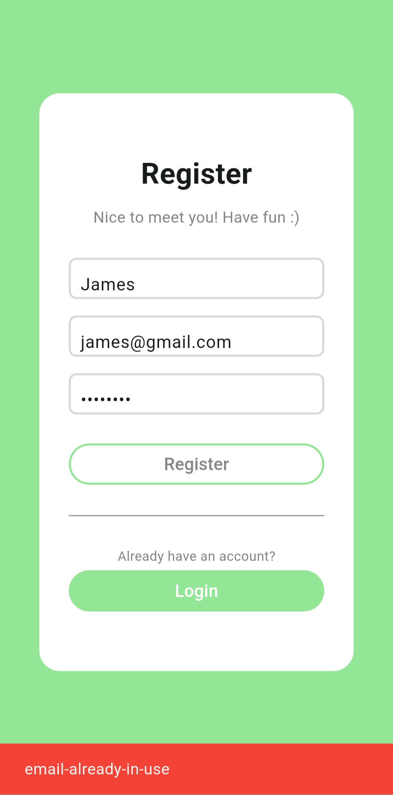
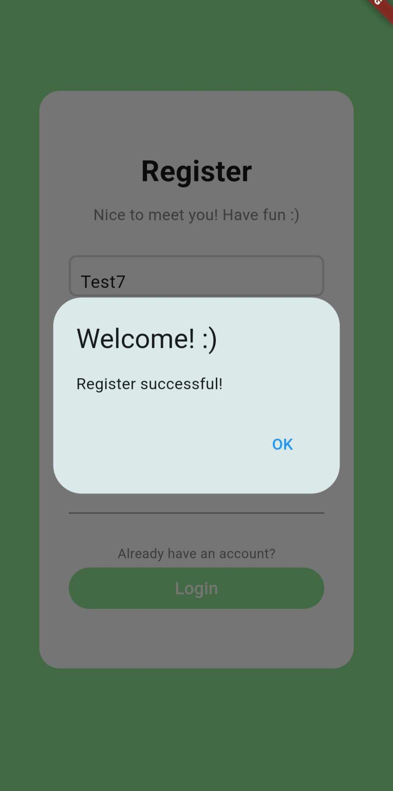

# chat_app

A simple chat app where you can chat with your friends online.

## APK Download
You can download the release version [here](app-release.apk)

## Features

### Login Page

   

 
 

- You can simply sign in with your registered email and password
- Also, you can sign in with your Google account
    - If you choose to sign in with Google, you don't need to register again 
    - The user name will be set to your email prefix (ex: banana@gmail.com -> banana)
- If an error occurs (ex: wrong email/password), a snack bar will show up to notice you

### Register Page

    

 
 

- You can create a new account by enter an user name, email and password
- If you already have a account, just press the "Login" button then it will guide you back to the Login page
- If an error occurs (ex: email has been used), a snack bar will show up to notice you
- If registration successful, an alert dialog will show up to notice you
    - Click the "OK" button to go to the chat list page
