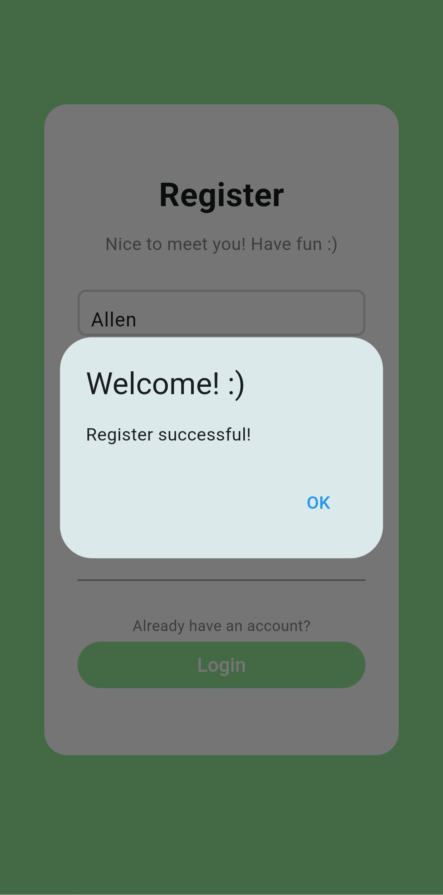

# chat_app

A simple chat app where you can chat with your friends online.

## APK Download
You can download the release version [here](app-release.apk)

## Introduction

### Login Page

   

 

- You can simply sign in with your registered email and password
- Also, you can sign in with your Google account
    - If you choose to sign in with Google, you don't need to register again 
    - The user name will be set to your email prefix (ex: banana@gmail.com -> banana)
- If an error occurs (ex: wrong email/password), a snack bar will show up to notice you

### Register Page

    

 

- You can create a new account by enter an user name, email and password
- If you already have a account, just press the "Login" button then it will guide you back to the Login page
- If an error occurs (ex: email has been used), a snack bar will show up to notice you
- If registration successful, an alert dialog will show up to notice you
    - Click the "OK" button to go to the chat list page

### Chat List Page

  

 

- Here is your friend list, select a friend to start chatting
- Every registered user will be on the list
- Press the button on the top left corner to logout

### Chat Page

   

 

- Chat with your friend in real-time
- Press the button on the top left corner to go back to chat list page
- The messages will be stored in Firestore

### Features

  

 
 

- Use Google Firebase to manage authentication, login, register
- Use Google Firebase Cloud Firestore to store user info and messages

### Development Phase
- Phase 1: Construct basic elements of the App
- Phase 2: Implement the message box in Chat page
    - Phase 2-1: The current user's message box
    - Phase 2-2: The other user's message box
    - Phase 2-3: Organize the layout
- Phase 3: Create the Textfield of Chat page
- Phase 4: Implement the UI of Login page and Register page
- Phase 5: Set up Google Firebase email/password authentication 
- Phase 6: Set up Google Firebase "Sign in with Google" service
- Phase 7: Implement the UI of Chat list page
- Phase 8: Set up Google Firebase Cloud Firestore (Store the user list and chat history)